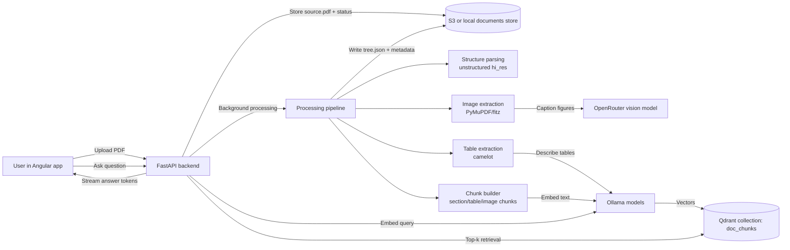
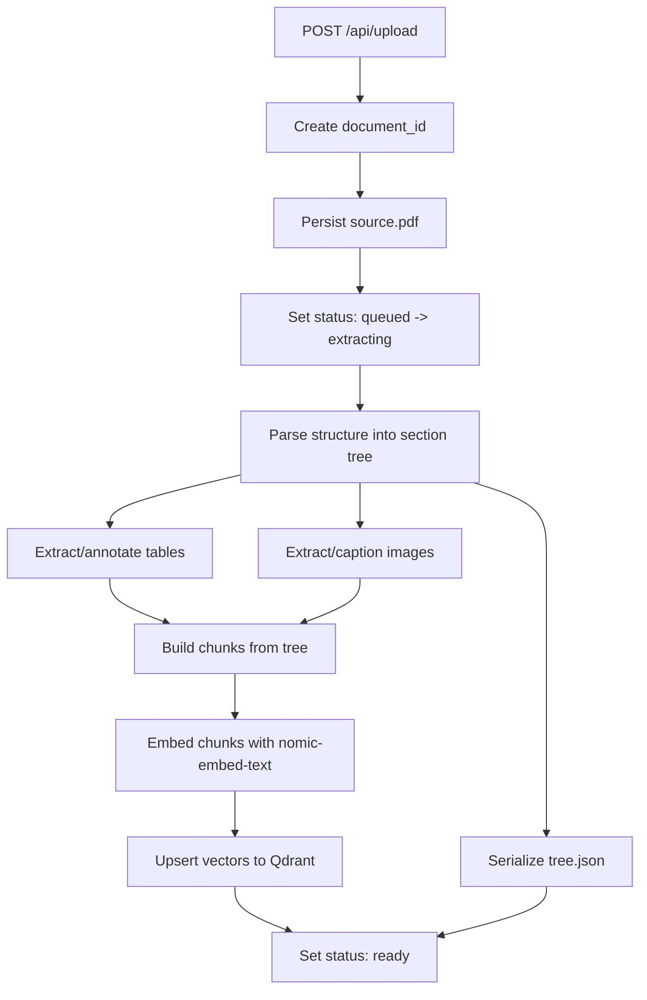

# chat_pdf

FastAPI + Angular app for chatting with PDFs. PDFs are processed through a
structured pipeline (unstructured -> camelot tables -> fitz figures +
OpenRouter vision captions), chunked by section, embedded with Ollama, and
stored in Qdrant. Chat retrieves the top-k chunks per query and streams the
answer through a local Ollama model.

## How the project works

This project has two major flows:

- **Ingestion flow**: a reviewer or user uploads a PDF; backend parses and enriches
  the document in the background; document artifacts are stored in S3/local data
  and vector embeddings are written to Qdrant.
- **Chat flow**: user asks a question; backend embeds the query, retrieves relevant
  chunks from Qdrant, then streams an answer from the chat model.

### End-to-end architecture (reviewer view)



### Document parsing and storage flow



## System dependencies

macOS (brew):

```bash
brew install poppler tesseract ghostscript tcl-tk
```

Ubuntu/Debian:

```bash
sudo apt install poppler-utils tesseract-ocr ghostscript python3-tk
```

Plus Docker (for Qdrant) and [Ollama](https://ollama.com).

## Services

```bash
# Qdrant
cd backend
docker compose up -d

# Ollama models
ollama pull gemma4:e4b
ollama pull nomic-embed-text
```

## Environment variables (optional)

| var | default | purpose |
| --- | --- | --- |
| `OLLAMA_BASE_URL` | `http://127.0.0.1:11434` | Ollama host |
| `OLLAMA_MODEL` | `gemma4:e4b` | chat model |
| `EMBEDDING_MODEL` | `nomic-embed-text` | embedding model |
| `EMBEDDING_DIM` | `768` | embedding dimensionality (must match model) |
| `QDRANT_URL` | `http://127.0.0.1:6333` | Qdrant endpoint |
| `QDRANT_COLLECTION` | `doc_chunks` | collection name |
| `OPENROUTER_API_KEY` | *(empty)* | enables figure captioning |
| `VISION_MODEL` | `google/gemini-2.5-flash` | OpenRouter vision model |
| `TABLE_DESCRIBER_MODEL` | same as `OLLAMA_MODEL` | describes tables |
| `CHUNK_TOKENS` | `800` | target tokens per text chunk |
| `CHUNK_OVERLAP` | `100` | token overlap between chunks |
| `RETRIEVAL_TOP_K` | `8` | chunks pulled from Qdrant per query |
| `CHATPDF_DATA_DIR` | `backend/data` | where uploaded PDFs + tree.json live |

## Backend

```bash
cd backend
uv sync
uv run uvicorn app.main:app --reload --port 8000
```

Lint and format (PEP 8-oriented):

```bash
cd backend
uv run ruff check app
uv run black --check app
uv run mypy app
```

Auto-fix style/imports:

```bash
cd backend
uv run ruff check --fix app
uv run black app
```

## Frontend

```bash
cd frontend
npm install
npm start
```

The Angular dev server proxies `/api` to the backend; open
`http://localhost:4200`.

## Data layout

Each uploaded document lives under `backend/data/documents/<doc_id>/`:

```
source.pdf       original upload
status.json      {status, stage, progress, error?, filename, num_pages?}
tree.json        unified document tree (sections, tables, images)
images/          figure PNGs extracted by fitz
```

And in vector storage (`QDRANT_COLLECTION`, default `doc_chunks`), each chunk is
stored as:

- embedding vector (`EMBEDDING_DIM`, default `768`)
- payload metadata (document id, chunk id, section/table/image context, text)
- point id namespace-scoped per document for delete/update operations

## API

| method | path | notes |
| --- | --- | --- |
| `POST` | `/api/upload` | multipart PDF; returns `{document_id, status}` immediately, processing runs in background |
| `GET` | `/api/documents/{doc_id}/status` | poll for `status in {queued, extracting, tables, images, embedding, ready, error}` |
| `GET` | `/api/documents/{doc_id}/tree` | the enriched `tree.json` once processing is ready |
| `POST` | `/api/chat/stream` | NDJSON stream `{"content": "..."}` lines |
| `DELETE` | `/api/documents/{doc_id}` | remove disk artifacts + Qdrant points |
| `GET` | `/api/health` | liveness |

## PDF ingestion pipeline

Uploaded PDFs are processed in the background through a preflight-classified
pipeline:

0. **Enqueue** — the upload endpoint stores the PDF and writes a `queued`
   row; it no longer parses in-process. A separate **worker process**
   (`python -m app.worker`, or the `worker` service in
   `docker-compose.prod.yml`) polls `document_state` and claims due documents
   atomically (`FOR UPDATE SKIP LOCKED`).
1. **Preflight classification** (`app/processing/preflight.py`) — Firecrawl's
   `pdf-inspector` (the Rust classifier AnyDoc/Fire-PDF uses) samples PDF
   content streams and font encodings in ~10–50ms and reports `text_based`,
   `scanned`, `image_based`, or `mixed`, plus a confidence score and per-page
   OCR routing. A minimal PyMuPDF check runs first because pdf-inspector's
   classifier does not detect encrypted files. Encrypted or corrupt files
   stop here with a terminal status (`encrypted` / `invalid`).
2. **Routing** — `text_based` documents run the Unstructured `fast` strategy;
   scanned/image-based and mixed documents run `hi_res`/OCR. Set
   `UNSTRUCTURED_STRATEGY=fast|hi_res` to force a strategy.
3. **Quality gates** — after extraction, output is checked for usable text or
   images per page, garbled/suspiciously repeated text, and printable
   character ratio. If the `fast` pass is low-quality, the pipeline retries
   with `hi_res` and records a warning instead of silently indexing
   near-empty text.

The classification decision and page-level details are written to the
document debug folder as `preflight.json`; the chosen route also appears in
the processing stage (`parsing document structure via fast|hi_res`).

## Input and resource safeguards

- **Upload validation** — the upload endpoint verifies the `%PDF` magic bytes
  (not just the `.pdf` suffix) and structural readability before anything is
  stored.
- **Encryption** — password-protected PDFs are detected during preflight and
  stop with an `encrypted` terminal status instead of being parsed.
- **Resource caps** (configurable in settings) — page count,
  decompressed-stream bytes (a decompression-bomb check), image count, and
  total processing duration. A document that exceeds a cap ends in a
  `resource_limit` status; the original file and the preflight/inspection
  diagnostics are preserved for support.
- **Precise terminal statuses** — `invalid` (corrupt/unreadable),
  `encrypted`, `resource_limit`, `parser_failure` (extraction crashed), and
  `partial` (indexed but some pages produced no usable output) are recorded
  on the document instead of a generic `error`. After retries are exhausted a
  document ends in `failed`.
- **Durability and bounds** — document-level retries with exponential backoff
  (default 3 attempts, `WORKER_MAX_ATTEMPTS` / `WORKER_RETRY_BASE_SECONDS`),
  leases that let a restarted worker reclaim documents stranded mid-extraction,
  and independent concurrency limits for documents (`WORKER_CONCURRENCY`),
  parsing/OCR/Camelot (`PARSE_CONCURRENCY`), embeddings
  (`EMBEDDING_CONCURRENCY`), and LLM table descriptions
  (`TABLE_LLM_CONCURRENCY`).

## Table handling (selective and observable)

- **Page detection before Camelot** — pypdf text is scanned for tabular
  signals (pipe-separated rows, tab runs, numeric multi-column lines) before
  any Camelot pass. Pages without signals are skipped entirely, so a
  text-only document never pays for the lattice+stream two-pass extraction.
  Thresholds are configurable (`TABLE_PAGE_PIPE_MIN_LINES`,
  `TABLE_PAGE_NUMERIC_MIN_LINES`).
- **Failures are logged, not swallowed** — Camelot exceptions are recorded
  per pass (lattice/stream) and surfaced as document warnings plus a
  `table_diagnostics.json` debug artifact (pages detected/skipped, pages per
  pass, errors, tables extracted). When no tables are extracted, the
  unstructured HTML placeholders already attached to table elements remain
  the retrieval fallback.
- **Description retries** — LLM table descriptions run behind the
  `TABLE_LLM_CONCURRENCY` semaphore with exponential-backoff retries
  (`TABLE_DESCRIBER_MAX_RETRIES`, `TABLE_DESCRIBER_RETRY_BASE_SECONDS`); on
  failure the keyword/summary heuristic fallback keeps table chunks
  retrievable.

## Figure coverage

- **Raster images** are rendered and stored as before; **vector charts and
  diagrams** (Matplotlib/Excel/PPTX exports that have no raster image object)
  are now detected per page via PyMuPDF drawing coverage
  (`VECTOR_VISUAL_COVERAGE_MIN`, `VECTOR_VISUAL_DRAWINGS_MIN`).
- Pages with vector visuals get synthetic image placeholders, so they produce
  retrievable chunks ("Vector chart/diagram on p.N" + nearby text) and are
  nominated for **query-time vision** exactly like raster figures. The
  document metadata now lists `visual_pages`, which the router prompt uses to
  nominate pages for on-demand analysis.
- The ingestion stage was renamed from "captioning figures" to "extracting
  figures" — captions/descriptions are deferred to query-time vision, and the
  status no longer claims captions are generated.

## Regression and benchmark suite

- `tests/test_pdf_regression.py` — deterministic checks on representative
  documents (text report, academic paper, financial tables, scanned, mixed,
  vector chart, corrupt, encrypted): routing decisions, page-accurate
  citations, table/text extraction, visual-candidate detection, and terminal
  statuses.
- `python -m benchmarks.run_benchmark` — builds the full corpus and reports
  parse duration, route correctness, text recall, page-level citation
  accuracy, and retrieval top-1 quality (deterministic fake embeddings, no
  external services) as JSON.

## Deployment (GitHub Actions + VPS)

The production image is built and pushed to GHCR by the
`build-push-ghcr.yml` workflow on every push to `main`, then deployed to the
VPS over SSH:

1. `docker login ghcr.io` + `docker pull ghcr.io/<owner>/chat-pdf-backend:latest`
2. `docker compose -p chatpdf -f docker-compose.prod.yml up -d
   --force-recreate --remove-orphans` — starts both the **api** and **worker**
   containers
3. `docker exec chat_pdf_api alembic upgrade head` — the worker retries its
   startup until the migration columns exist, so the order does not matter

The worker uses the same image with `entrypoint: ["python", "-m",
"app.worker"]` and the same `.env` (DATABASE_URL, storage, Qdrant, model
config). On a new VPS, copy `docker-compose.prod.yml` and a filled `.env`
into `~/chat-pdf-prod` (as the workflow expects).


1. Fix silent loss of pre-heading/root text

  Problem: text that appears before the first detected heading can sit on the root section. When child sections also exist, the chunker skips that root text, so it is never embedded or retrievable.

  What to change:

  - Always include the root section when it has any indexable elements—not only when it has a non-text element.
  - Give root-level chunks a usable label such as Document or Preamble, rather than an empty section_path.
  - Do not duplicate content: walk_sections(root) excludes the root, so explicitly adding it once is safe.

  Conceptually:

  sections = list(walk_sections(root))
  if root.elements:
      sections.insert(0, root)

  Then ensure root chunks embed with a fallback path:

  section_path = section.path or "Document"

  Tests to add:

  - PDF-like tree with opening text on page 1, then a heading and section on page 2.
  - Assert both opening text and section text produce chunks.
  - Assert the opening chunk’s section_path is Document/Preamble.
  - Keep a test for root-only documents and synthetic root tables/images.

  2. Make text chunks page-accurate

  Problem: a section can span pages, but every resulting text chunk is currently tagged with the first page, first-page bounding box, and all element IDs in that section. A chunk containing page-8 text can therefore cite page 2.

  What to change:

  - Chunk from ordered ElementRefs, not from one merged section-wide string.
  - At minimum, create text chunks within a single page.
  - For every chunk, retain only:
      - the IDs of elements actually included;
      - its actual page;
      - a bbox union calculated only from those elements on that page.

  - Keep the section path as semantic context in the embedding text.

  Recommended shape:

  Section “Methods”
    page 4 elements → one or more page-4 chunks
    page 5 elements → one or more page-5 chunks
    page 6 elements → one or more page-6 chunks

  This slightly increases chunk/vector count, but it makes citations, highlights, retrieval context, and on-demand vision materially more reliable. For text, I would avoid cross-page chunks entirely; tables already have explicit page
  ranges.

  Tests to add:

  - A section with text elements on two pages and enough text to create several chunks.
  - Assert every chunk has the right page, bbox, and exact element_ids.
  - Assert no page-2 chunk contains page-3 content.
  - Assert the retrieved citation page matches the source text page.

  3. Replace the “under 50 characters” scan heuristic with document/page classification

  Problem: character count is not a reliable way to decide whether a PDF needs OCR/layout analysis. A noisy scan may have more than 50 junk characters and remain on the weak fast route; a legitimate sparse text PDF may unnecessarily enter
  hi_res.

  What to change:

  - Add a lightweight preflight classification stage before Unstructured.
  - Classify the PDF as text, scanned/image, or mixed, ideally per page.
  - Use the classification to choose the parser strategy and record the decision.

  Routing policy:

   Classification                 Route
  ━━━━━━━━━━━━━━━━━━━━━━━━━━━━━  ━━━━━━━━━━━━━━━━━━━━━━━━━━━━━━━━━━━━━━━━━━━━━━━━━━━━━━━━━━━━━━
   Text-based, high confidence    fast
  ─────────────────────────────  ──────────────────────────────────────────────────────────────
   Scanned/image-only             hi_res / OCR route
  ─────────────────────────────  ──────────────────────────────────────────────────────────────
   Mixed                          Prefer page-aware routing; otherwise hi_res for the document
  ─────────────────────────────  ──────────────────────────────────────────────────────────────
   Encrypted/corrupt              Return an explicit unsupported/error state

  The best option is to use pdf-inspector as the preflight classifier—it is the same PDF component AnyDoc uses and reports text/scanned/mixed classification. Alternatively, use PyMuPDF to calculate page-level text density and image
  coverage, but that will be less reliable.

  Add quality gates after extraction too:

  - extracted characters/words per page;
  - proportion of printable characters;
  - suspiciously repeated/garbled OCR text;
  - number of pages with no usable output.

  If fast produces low-quality output, retry hi_res; if that fails, mark the document as partial/error with a precise warning rather than silently indexing near-empty text.

  Tests to add:

  - normal text PDF → fast;
  - image-only scan → hi_res;
  - mixed PDF → mixed route;
  - sparse cover page plus normal later pages → do not classify the whole document as scanned;
  - corrupt/encrypted PDF → clear terminal status.

  4. Add input and resource safeguards

  - Verify PDF magic bytes, not only the .pdf suffix.
  - Detect encryption before processing.
  - Cap page count, decompressed size, image count, and processing duration.
  - Return specific statuses: invalid file, encrypted, resource limit, parser failure, partial extraction.
  - Preserve the original file and diagnostic metadata for support/debugging.

  5. Make ingestion durable and bounded

  - Move heavy parsing from FastAPI BackgroundTasks to a worker queue.
  - Apply document-level retries and idempotency.
  - Limit concurrent parsing, OCR, Camelot, embedding, and LLM work independently.
  - Ensure restarts do not strand documents indefinitely in extracting.

  6. Make table handling selective and observable

  - Detect likely table pages before running Camelot’s two passes.
  - Log extraction failures rather than converting them silently to “no tables.”
  - Put table-description calls behind a concurrency semaphore and retry policy.
  - Keep the current heuristic fallback when LLM descriptions fail.

  7. Improve figure coverage

  - Continue storing raster images.
  - Add detection of vector drawings/charts, or mark their pages as visual candidates.
  - Let retrieval or the router nominate these pages for query-time vision.
  - Rename the current status from “captioning figures,” since captions are currently deferred/not generated during ingestion.

  8. Build a real PDF regression and benchmark suite

  Use representative documents: reports, academic papers, financial tables, multi-column layouts, scans, mixed PDFs, vector charts, corrupt files, and encrypted files.

  Measure:

  - parse duration;
  - upload-to-ready duration;
  - memory/CPU;
  - page-level citation correctness;
  - text/table recall;
  - scan success rate;
  - retrieval quality.
