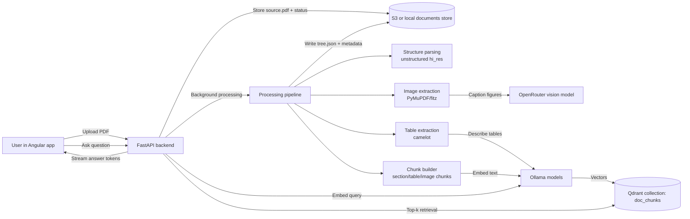
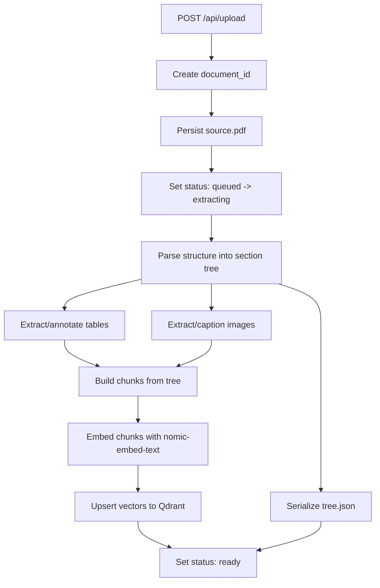

# chat_pdf

FastAPI + Angular app for chatting with PDFs. PDFs are processed through a
structured pipeline (unstructured -> camelot tables -> fitz figures +
OpenRouter vision captions), chunked by section, embedded with Ollama, and
stored in Qdrant. Chat retrieves the top-k chunks per query and streams the
answer through a local Ollama model.

## How the project works

This project has two major flows:

- **Ingestion flow**: a reviewer or user uploads a PDF; backend parses and enriches
  the document in the background; document artifacts are stored in S3/local data
  and vector embeddings are written to Qdrant.
- **Chat flow**: user asks a question; backend embeds the query, retrieves relevant
  chunks from Qdrant, then streams an answer from the chat model.

### End-to-end architecture (reviewer view)



### Document parsing and storage flow



## System dependencies

macOS (brew):

```bash
brew install poppler tesseract ghostscript tcl-tk
```

Ubuntu/Debian:

```bash
sudo apt install poppler-utils tesseract-ocr ghostscript python3-tk
```

Plus Docker (for Qdrant) and [Ollama](https://ollama.com).

## Services

```bash
# Qdrant
cd backend
docker compose up -d

# Ollama models
ollama pull gemma4:e4b
ollama pull nomic-embed-text
```

## Environment variables (optional)

| var | default | purpose |
| --- | --- | --- |
| `OLLAMA_BASE_URL` | `http://127.0.0.1:11434` | Ollama host |
| `OLLAMA_MODEL` | `gemma4:e4b` | chat model |
| `EMBEDDING_MODEL` | `nomic-embed-text` | embedding model |
| `EMBEDDING_DIM` | `768` | embedding dimensionality (must match model) |
| `QDRANT_URL` | `http://127.0.0.1:6333` | Qdrant endpoint |
| `QDRANT_COLLECTION` | `doc_chunks` | collection name |
| `OPENROUTER_API_KEY` | *(empty)* | enables figure captioning |
| `VISION_MODEL` | `google/gemini-2.5-flash` | OpenRouter vision model |
| `TABLE_DESCRIBER_MODEL` | same as `OLLAMA_MODEL` | describes tables |
| `CHUNK_TOKENS` | `800` | target tokens per text chunk |
| `CHUNK_OVERLAP` | `100` | token overlap between chunks |
| `RETRIEVAL_TOP_K` | `8` | chunks pulled from Qdrant per query |
| `CHATPDF_DATA_DIR` | `backend/data` | where uploaded PDFs + tree.json live |

## Backend

```bash
cd backend
uv sync
uv run uvicorn app.main:app --reload --port 8000
```

Lint and format (PEP 8-oriented):

```bash
cd backend
uv run ruff check app
uv run black --check app
uv run mypy app
```

Auto-fix style/imports:

```bash
cd backend
uv run ruff check --fix app
uv run black app
```

## Frontend

```bash
cd frontend
npm install
npm start
```

The Angular dev server proxies `/api` to the backend; open
`http://localhost:4200`.

## Data layout

Each uploaded document lives under `backend/data/documents/<doc_id>/`:

```
source.pdf       original upload
status.json      {status, stage, progress, error?, filename, num_pages?}
tree.json        unified document tree (sections, tables, images)
images/          figure PNGs extracted by fitz
```

And in vector storage (`QDRANT_COLLECTION`, default `doc_chunks`), each chunk is
stored as:

- embedding vector (`EMBEDDING_DIM`, default `768`)
- payload metadata (document id, chunk id, section/table/image context, text)
- point id namespace-scoped per document for delete/update operations

## API

| method | path | notes |
| --- | --- | --- |
| `POST` | `/api/upload` | multipart PDF; returns `{document_id, status}` immediately, processing runs in background |
| `GET` | `/api/documents/{doc_id}/status` | poll for `status in {queued, extracting, tables, images, embedding, ready, error}` |
| `GET` | `/api/documents/{doc_id}/tree` | the enriched `tree.json` once processing is ready |
| `POST` | `/api/chat/stream` | NDJSON stream `{"content": "..."}` lines |
| `DELETE` | `/api/documents/{doc_id}` | remove disk artifacts + Qdrant points |
| `GET` | `/api/health` | liveness |
